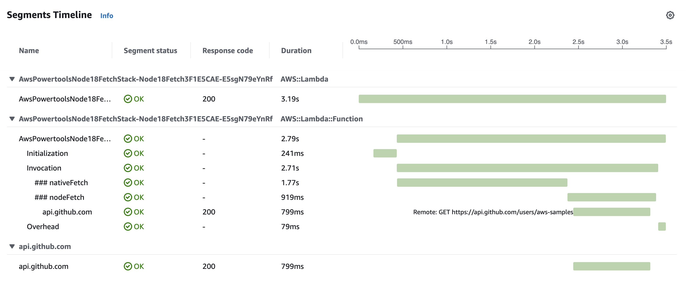

# Bug report for AWS powertools typescript

This repo is a minimal reproduction of a bug in the AWS powertools typescript library.
The Tracing module is not working as expected.
Fetch calls that are made with the native nodejs 18 fetch function are not traced.
Whereas fetch calls that are made with the node-fetch library are traced.

The screenshot shows the difference between the two fetch calls.
See the code in [`lib/node-18-fetch.ts`](lib/node-18-fetch.ts) for more details.

## Useful commands

- `npm run build` compile typescript to js
- `npm run watch` watch for changes and compile
- `npm run test` perform the jest unit tests
- `cdk deploy` deploy this stack to your default AWS account/region
- `cdk diff` compare deployed stack with current state
- `cdk synth` emits the synthesized CloudFormation template
